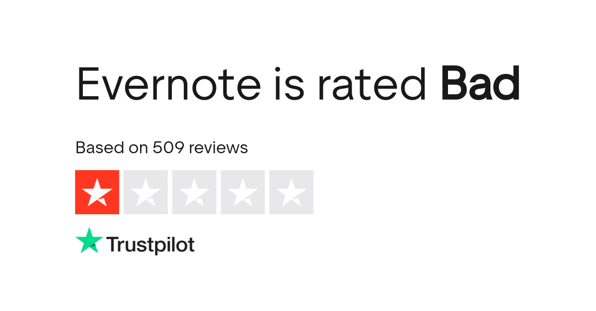
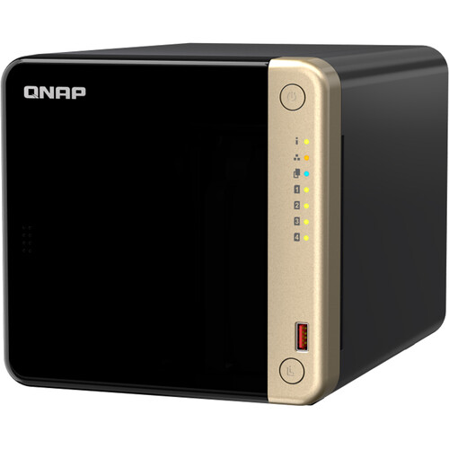
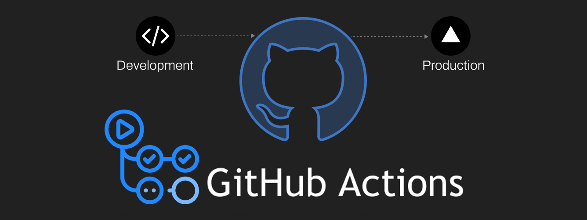
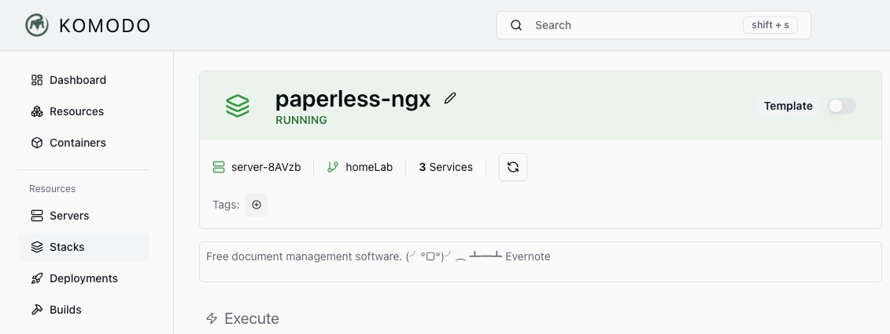
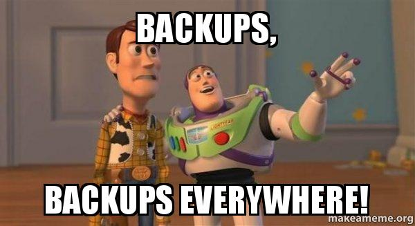
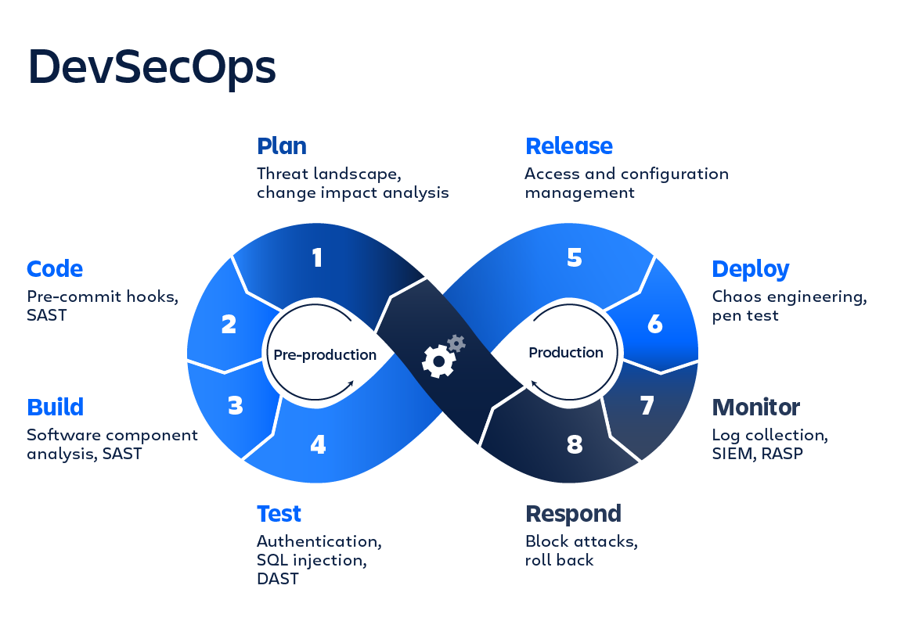

I've been an Evernote user since 2010. Back then, a yearly subscription was about $45. It was indispensable while I was backpacking across Asia, giving me instant access to scanned passports, receipts, and tickets in India, Singapore, and Japan. Having critical documents on hand, anywhere in the world, was a lifesaver.



But over the years, the service changed. The app felt slower, features I relied on were deprecated, and the price climbed dramatically. Today, a personal plan costs nearly $130 a year. I decided there had to be a better way to regain control over my data and save money.

I learned about **Paperless-ngx** through two main sources: [/r/selfhosted](https://www.reddit.com/r/selfhosted/comments/1lg8ydc/whats_the_benefit_of_paperlessngx/) and from DB Tech's video [Transform Your Chaos into Order: Quick Paperless-NGX Setup with Docker!](https://www.youtube.com/watch?v=2UdlUYi0bmk)

**Paperless-ngx** is a powerful, private, and free alternative to Evernote. The initial setup doesn't take much work, but I had plans to automate backups and configuration management from the start.

---

## The Setup Environment

Over the years, I've gradually assembled my homelab with various devices. The NAS was purchased to replace an outdated Plex server — a 2010 Mac Mini with a tangle of external hard drives.

### The Brains (NAS)



- **Model:** QNAP TS-464
- **Specs:** Intel Celeron N5105 @ 2.00GHz, 16GB RAM, 32TB Storage
- **Role:** Runs Docker containers, stores all documents, and executes scheduled automation scripts.

### The Workstation


- **Model:** Mac Mini M2
- **Role:** Development and management hub — writing code, managing the Git repository, and connecting to the NAS via SSH.
- **Tools:** Visual Studio Code, Terminal.

### The Control Center



- **Service:** GitHub
- **Role:** The single source of truth for all automation scripts and the engine for our **CI/CD pipeline** via GitHub Actions.

---

## Part I: Deploying Paperless-ngx



The QNAP comes with a "Container Station" app for Docker containers. I've sidestepped it in favor of [Komodo](https://github.com/moghtech/komodo), which has more options and a much better UI. Docker Compose files are hosted on a private GitHub repository linked to Komodo. Komodo pulls the `docker-compose.yaml` for Paperless-ngx and builds/runs it with no manual steps — including automatic image updates.

Here's the Docker Compose file I use:

> [!NOTE]- Paperless-ngx Docker Compose
> ```yaml
> # paperless-ngx/compose.yaml
> services:
>   broker:
>     image: docker.io/library/redis:8
>     restart: unless-stopped
>     volumes:
>       - redisdata:/data
>
>   db:
>     image: docker.io/library/postgres:17
>     restart: unless-stopped
>     volumes:
>       - pgdata:/var/lib/postgresql/data
>     environment:
>       POSTGRES_DB: ${POSTGRES_DB}
>       POSTGRES_USER: ${POSTGRES_USER}
>       POSTGRES_PASSWORD: ${POSTGRES_PASSWORD}
>     healthcheck:
>       test: ["CMD-SHELL", "pg_isready -U $$POSTGRES_USER -d $$POSTGRES_DB"]
>       interval: 10s
>       timeout: 5s
>       retries: 5
>
>   webserver:
>     image: ghcr.io/paperless-ngx/paperless-ngx:latest
>     container_name: paperless-webserver
>     restart: unless-stopped
>     depends_on:
>       db:
>         condition: service_healthy
>       broker:
>         condition: service_started
>     ports:
>       - "8000:8000"
>     volumes:
>       - ${CONTAINER_DIR}/data:/usr/src/paperless/data
>       - ${CONTAINER_DIR}/media:/usr/src/paperless/media
>       - ${CONTAINER_DIR}/export:/usr/src/paperless/export
>       - ${CONTAINER_DIR}/consume:/usr/src/paperless/consume
>     environment:
>       PAPERLESS_REDIS: redis://broker:6379
>       PAPERLESS_DBHOST: db
>       PAPERLESS_DBUSER: ${POSTGRES_USER}
>       PAPERLESS_DBPASS: ${POSTGRES_PASSWORD}
>       PAPERLESS_DBNAME: ${POSTGRES_DB}
>       PAPERLESS_CONSUMER_POLLING: 60
>       PAPERLESS_CONSUMER_USE_INOTIFY: false
>       PAPERLESS_URL: ${PAPERLESS_URL}
>       PAPERLESS_CSRF_TRUSTED_ORIGINS: ${PAPERLESS_CSRF_TRUSTED_ORIGINS}
>       PAPERLESS_TIME_ZONE: ${PAPERLESS_TIME_ZONE}
>       PAPERLESS_OCR_LANGUAGE: ${PAPERLESS_OCR_LANGUAGE}
>       USERMAP_UID: ${USERMAP_UID}
>       USERMAP_GID: ${USERMAP_GID}
>     healthcheck:
>       test: ["CMD-SHELL", "curl -f http://localhost:8000 || exit 1"]
>       interval: 30s
>       timeout: 10s
>       retries: 5
>     networks:
>       - proxy-network
>       - default
>
> networks:
>   proxy-network:
>     external: true
>   default:
>
> volumes:
>   pgdata:
>   redisdata:
> ```

---

## Part II: The Backup System



Automating my Paperless system raised an immediate concern: without proper backups and version control, troubleshooting scripts becomes nearly impossible once you've forgotten they exist.

The solution uses two core components:

**1. Shell Scripts** — A few simple scripts handle the logic:

- `paperless_doc_exporter.sh` — runs the `document_exporter` command inside the Paperless container
- `reclone_backup.sh` — uses [`rclone`](https://rclone.org/) to upload to an offsite location (Google Drive) and prune old backups

> [!NOTE]- paperless_doc_exporter.sh
> ```bash
> #!/bin/sh
> . "$(dirname "$0")/backup.conf"
>
> echo "--- Starting Paperless Exporter Backup on $(date) ---" | tee -a "${EXPORT_LOG_FILE}"
> echo "Found container: ${WEBSERVER_CONTAINER_NAME}. Starting export..." | tee -a "${EXPORT_LOG_FILE}"
>
> /share/CACHEDEV1_DATA/.qpkg/container-station/bin/docker exec "${WEBSERVER_CONTAINER_NAME}" \
>     document_exporter ../export --zip --zip-name "paperless_full_export"
>
> echo "Export complete. Output file is paperless_full_export.zip" | tee -a "${EXPORT_LOG_FILE}"
> echo "--- Export Backup Complete ---" | tee -a "${EXPORT_LOG_FILE}"
> ```

> [!NOTE]- reclone_backup.sh
> ```bash
> #!/bin/sh
> . "$(dirname "$0")/backup.conf"
>
> echo "--- Starting Rclone Backup Process on $(date) ---"
>
> if [ ! -f "$LOCAL_BACKUP_PATH" ]; then
>     echo "!!! DANGER: Local backup file not found at $LOCAL_BACKUP_PATH. Aborting."
>     exit 1
> fi
>
> CURRENT_SIZE=$(stat -c%s "$LOCAL_BACKUP_PATH")
> if [ "$CURRENT_SIZE" -lt "$MINIMUM_SIZE_BYTES" ]; then
>     echo "!!! DANGER: New backup size ($CURRENT_SIZE bytes) is below minimum threshold. Aborting."
>     exit 1
> fi
>
> echo "Local backup is valid (Size: $CURRENT_SIZE bytes). Proceeding with upload."
>
> PAPERLESS_VERSION=$(docker exec "${WEBSERVER_CONTAINER_NAME}" /bin/sh -c "cat /app/VERSION" 2>/dev/null)
> [ -z "$PAPERLESS_VERSION" ] && PAPERLESS_VERSION="unknown"
>
> DATED_FILENAME="paperless_backup - $(date +'%Y-%m-%d') - v${PAPERLESS_VERSION}.zip"
> echo "Uploading to remote: ${GDRIVE_REMOTE}/${DATED_FILENAME}"
>
> if ! /share/CACHEDEV1_DATA/.qpkg/container-station/bin/docker run --rm \
>     -v /share/CACHEDEV1_DATA/Container/rclone/config:/config/rclone \
>     -v /share/CACHEDEV1_DATA/Container/paperless:/data/paperless \
>     rclone/rclone:latest copyto \
>     /data/paperless/export/paperless_full_export.zip \
>     "${GDRIVE_REMOTE}/${DATED_FILENAME}" -v; then
>     echo "!!! DANGER: rclone upload failed. Aborting cleanup to protect old backups."
>     exit 1
> fi
>
> echo "Upload complete. Cleaning up backups older than ${RETENTION_DAYS}..."
> /share/CACHEDEV1_DATA/.qpkg/container-station/bin/docker run --rm \
>     -v /share/CACHEDEV1_DATA/Container/rclone/config:/config/rclone \
>     rclone/rclone:latest delete "${GDRIVE_REMOTE}" --min-age "${RETENTION_DAYS}" -v
>
> echo "--- Backup process finished successfully ---"
> exit 0
> ```

**2. Persistent Scheduling** — QNAP has a quirk: cron jobs created via SSH don't survive a reboot. The fix is a special `autorun.sh` boot script on a persistent system partition. It runs once at startup, checks the crontab, and writes the correct jobs if they're missing.

> [!NOTE]- autorun.sh
> ```bash
> #!/bin/sh
> CONF_FILE="/share/CACHEDEV1_DATA/Container/homelab-scheduler/nas-automation/scripts/backup.conf"
>
> if [ ! -f "$CONF_FILE" ]; then
>     logger "AUTORUN ERROR: Backup config file not found at ${CONF_FILE}. Cannot update cron."
>     exit 1
> fi
>
> . "$CONF_FILE"
>
> CRONTAB_FILE="/etc/config/crontab"
>
> if ! grep -q "$JOB_ID" "$CRONTAB_FILE"; then
>     logger "Updating Paperless-NGX backup schedule from config file..."
>
>     sed -i '/paperless_export_backup.sh/d' "$CRONTAB_FILE"
>     sed -i '/rclone_paperless_backup.sh/d' "$CRONTAB_FILE"
>     sed -i '/# PAPERLESS_BACKUP/d' "$CRONTAB_FILE"
>
>     cat << EOF >> "$CRONTAB_FILE"
> ${JOB_ID_BLOCK}
> # 1. Import new documents from GDrive every 15 minutes
> */15 * * * * ${REPO_PATH}/nas-automation/scripts/import_from_gdrive.sh >> ${LOG_BASE_PATH}/import_activity.log 2>&1
> # 2. Create the local backup archive every night at 2:05 AM
> 5 2 * * * ${EXPORT_SCRIPT_PATH} >> ${EXPORT_LOG_FILE} 2>&1
> # 3. Upload to GDrive and prune old backups at 3:05 AM
> 5 3 * * * ${RCLONE_SCRIPT_PATH} >> ${RCLONE_LOG_FILE} 2>&1
> EOF
>
>     crontab "$CRONTAB_FILE"
>     /etc/init.d/crond.sh restart
>     logger "Paperless-NGX backup schedule updated successfully."
> else
>     logger "Paperless-NGX backup schedule is already up-to-date. No changes made."
> fi
>
> exit 0
> ```

See [QNAP: Running Your Own Application at Startup](https://www.qnap.com/en/how-to/faq/article/running-your-own-application-at-startup) for the full details on this approach.

---

## Part III: The "Pro" Upgrade — GitOps and CI/CD

This is where the project evolves from a collection of scripts into a professional-grade system.



The core principle of GitOps is treating your infrastructure configuration as code. Instead of SSH-ing into the NAS to edit a script, you make changes locally and push to GitHub. The system then automatically updates itself to match the desired state in the repository.

### The CI/CD Pipeline

The automation is defined in `.github/workflows/deploy-on-nas.yml` and runs in two stages:

**CI (Continuous Integration):** On every push, quality-gate jobs run first in the cloud:
- `shellcheck` — finds bugs in shell scripts
- `cspell` — catches spelling errors in scripts and docs
- `gitleaks` — scans for accidentally committed secrets

If any check fails, the process stops. Nothing broken ever reaches the NAS.

**CD (Continuous Deployment):** If all CI checks pass, the final `deploy` job runs on a self-hosted runner — a small Docker container on the NAS that connects *outbound* to GitHub (no open firewall ports required). It uses `rsync` to sync the validated files to the active script directory.

> [!NOTE]- deploy-on-nas.yml
> ```yaml
> name: CI Checks and Deploy to NAS
>
> on:
>   push:
>     branches: [main]
>   pull_request:
>     branches: [main]
>
> jobs:
>   shellcheck:
>     name: Lint Shell Scripts
>     runs-on: ubuntu-latest
>     steps:
>       - uses: actions/checkout@v4
>       - uses: ludeeus/action-shellcheck@master
>         env:
>           SHELLCHECK_OPIS: "-x"
>
>   spellcheck:
>     name: Spell Check
>     runs-on: ubuntu-latest
>     steps:
>       - uses: actions/checkout@v4
>       - uses: streetsidesoftware/cspell-action@v6
>         with:
>           files: '**/*.{md,sh,yml}'
>
>   gitleaks:
>     name: Scan for Secrets
>     runs-on: ubuntu-latest
>     steps:
>       - uses: actions/checkout@v4
>         with:
>           fetch-depth: 0
>       - uses: gitleaks/gitleaks-action@v2
>
>   deploy:
>     name: Deploy to NAS
>     needs: [shellcheck, spellcheck, gitleaks]
>     runs-on: self-hosted
>     steps:
>       - uses: actions/checkout@v4
>       - name: Sync files to NAS
>         run: rsync -av --delete ${{ github.workspace }}/ /path/on/nas/to/your/scripts/
>       - name: Generate Job Summary
>         if: success()
>         run: |
>           echo "### ✅ Deployment to NAS Successful" >> $GITHUB_STEP_SUMMARY
>           echo "Synced commit \`${{ github.sha }}\`" >> $GITHUB_STEP_SUMMARY
> ```

> [!NOTE]- Repository structure
> ```
> homelab-scheduler/
> ├── .github/
> │   └── workflows/
> │       └── deploy-on-nas.yml
> ├── nas-automation/
> │   └── scripts/
> │       ├── autorun.sh
> │       ├── backup.conf
> │       └── ...
> ├── cspell.json
> └── README.md
> ```

The result is a push-to-deploy system. A `git push` from the Mac automatically and safely updates the scripts running on the NAS.

---

## Conclusion

Paperless-ngx now automatically backs up every night and pushes copies to a remote location. The next step is using local AI to automate document title generation and metadata tagging — but that's a post for another day.
