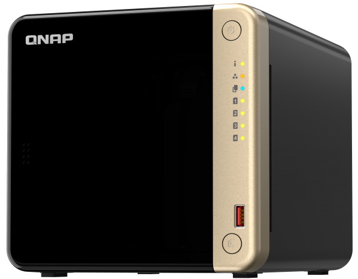

A running list of the hardware I use and recommend. Affiliate links coming soon.

---

## Daily Drivers

### Mac Mini (M2)

**Mac Mini M2** — The main workstation. Handles everything from SSH sessions into the lab to video editing.

### MacBook Air (M1, 2020)

**MacBook Air M1** — The mobile command center. Writing code and monitoring dashboards away from the desk.

---

## 3D Printing

### Bambu Lab P1S

**Bambu Lab P1S** — A fully enclosed, multi-material capable printer. Fast, quiet, and reliable enough to leave running overnight.

<!-- Link to blog post when published: [Read more: Got a 3D printer... and no I will not be printing dragons](/blog/got-a-3d-printer) -->

### Frostbite Build Plate

**Frostbite Build Plate** — A textured PEI plate with an aggressive grip when cold. Parts release cleanly once the plate cools. No more failed first layers.

<!-- Link to blog post when published: [Read more: New build plate - it's sticky...](/blog/frostbite-build-plate) -->

### Calipers & Tools

**Digital Calipers + Print Tools** — The usual suspects: calipers for fit testing, flush cutters for supports, and a scraper that hasn't launched a print across the room yet.

---

### What I'm Printing With

> My current go-to filament is **SUNLU Matte Black PLA**. The matte finish hides layer lines better than glossy PLA and photographs well. I've been running it through everything on the P1S.
>
> <!-- Sponsor swap: replace above line with sponsored filament copy when applicable -->
>
> <!-- Link to blog post when published: [Read more: Favorite filaments (and some not so nice ones)](/blog/favorite-filaments) -->

---

## Camera Gear

### Sony A7S

**Sony A7S** — Low-light performance that makes homelab photography forgiving. Used for all the gear shots on this site.

### DJI Osmo Pocket 3

**DJI Osmo Pocket 3** — Compact and stabilized. Good for quick walkthroughs and bench footage without setting up a full rig.

---

## Homelab

### QNAP TS-464

**QNAP TS-464** — The core of the lab. Runs Docker containers, handles mass storage, and executes all scheduled automation. Intel N5105 with QuickSync for hardware transcoding.

### Unmanaged 2.5GbE Switch (5-Port)

**Unmanaged 2.5GbE Switch** — Upgraded the backbone from 1Gbps to match the QNAP's throughput. Made a noticeable difference in transfer speeds.

---

*Updated as hardware rotates. If you see something here, I'm actively using it.*
